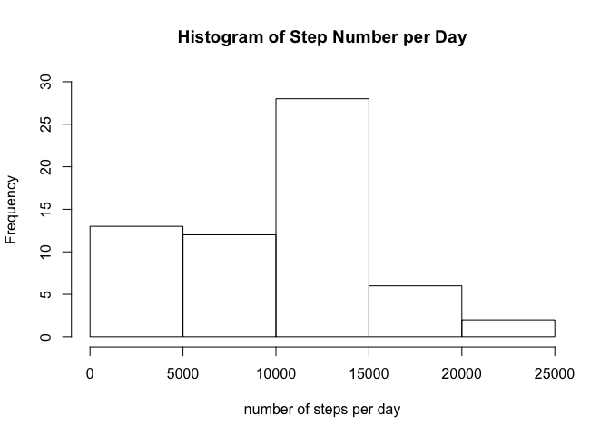
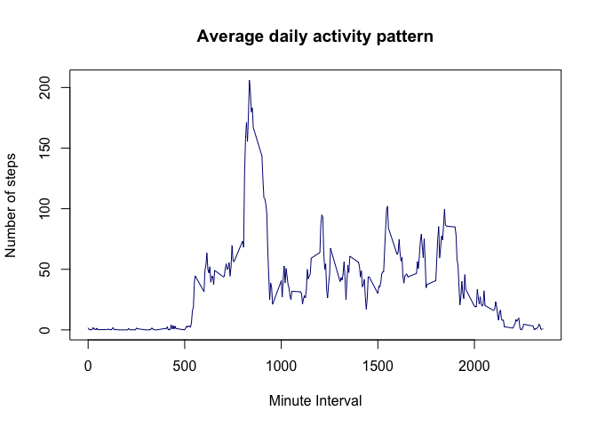
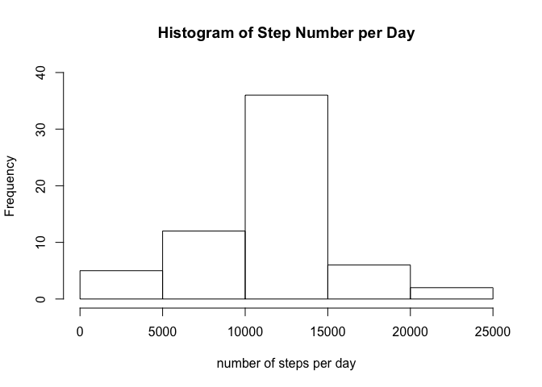
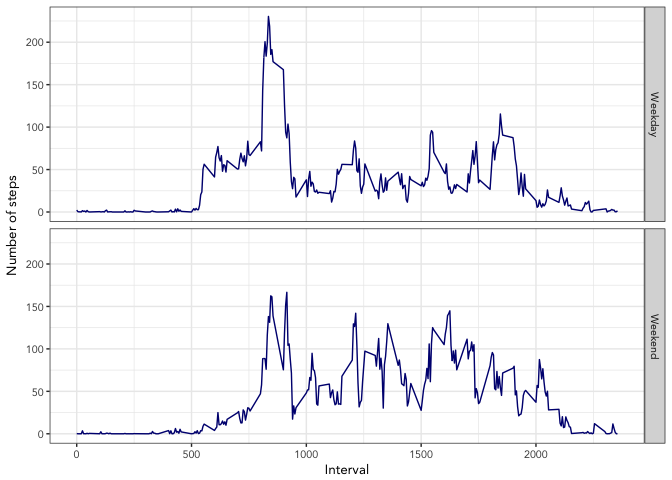

## Loading and preprocessing the data

```r
unzip("activity.zip", files = "activity.csv")
activity <- read.csv("activity.csv", header = TRUE)
activity$date <- as.Date(activity$date, "%Y-%m-%d")
```

## What is mean total number of steps taken per day?

```r
sum1 <- with(activity, tapply(steps, date, sum, na.rm = TRUE))
hist(sum1, xlab = "number of steps per day", nclass = 7, ylim = c(0,30), main = "Histogram of Step Number per Day")
```

<!-- -->

*The mean of the total number of steps per day

```r
mean(sum1)
```

```
## [1] 9354.23
```
*The median of the total number of steps per day

```r
median(sum1)
```

```
## [1] 10395
```
## What is the average daily activity pattern?

```r
average <- with(activity, tapply(steps, interval, mean, na.rm = TRUE))
plot(names(average), average, type = "l", col = "navy", ylab = "Number of steps", xlab = "Minute Interval", main = "Average daily activity pattern" )
```

<!-- -->

*The 5-minute interval contain the maximum number of steps

```r
names(which.max(average))
```

```
## [1] "835"
```
## Imputing missing values
The total nuber of missing values in the dataset

```r
sum(is.na(activity$steps))
```

```
## [1] 2304
```
The mean for each 5-minute interval is used to fill in all of the missing values in the dataset. From the above strategy, a new dataset that is equal to the original dataset but with the missing data filled in is created.

```r
library(data.table)
missing <- which(is.na(activity$steps))
average <- with(activity, tapply(steps, interval, mean, na.rm = TRUE))
average <- unlist(average)
activity_filling <- copy(activity)
activity_filling$interval <- as.factor(activity_filling$interval)
for (i in missing) {
        fill <- average[activity_filling[i,3]]
        activity_filling[i,1] <- fill
}
head(activity_filling)
```

```
##       steps       date interval
## 1 1.7169811 2012-10-01        0
## 2 0.3396226 2012-10-01        5
## 3 0.1320755 2012-10-01       10
## 4 0.1509434 2012-10-01       15
## 5 0.0754717 2012-10-01       20
## 6 2.0943396 2012-10-01       25
```

```r
sum2 <- with(activity_filling, tapply(steps, date, sum))
hist(sum2, xlab = "number of steps per day", nclass = 7, ylim = c(0,40), main = "Histogram of Step Number per Day")
```

<!-- -->

*The mean of the total number of steps per day

```r
mean(sum2)
```

```
## [1] 10766.19
```
*The median of the total number of steps per day

```r
median(sum2)
```

```
## [1] 10766.19
```
These new median and mean values are different from the estimates from the first part of the assigment.The frequency of the days that have the total step number less than 5000 is reduced while the frequency of the days that have the step number between 10,000 and 15,000 increases.

## Are there differences in activity patterns between weekdays and weekends?

```r
library(dplyr)
```

```
## 
## Attaching package: 'dplyr'
```

```
## The following objects are masked from 'package:data.table':
## 
##     between, first, last
```

```
## The following objects are masked from 'package:stats':
## 
##     filter, lag
```

```
## The following objects are masked from 'package:base':
## 
##     intersect, setdiff, setequal, union
```

```r
activity_filling <- mutate(activity_filling, day = weekdays(activity_filling$date))
for (i in 1:nrow(activity_filling)) {
        if (activity_filling[i,4] %in% c("Saturday", "Sunday")) {
           activity_filling[i,4] <- "Weekend"
        } else {activity_filling[i,4] <- "Weekday"}
        }
head(activity_filling)
```

```
##       steps       date interval     day
## 1 1.7169811 2012-10-01        0 Weekday
## 2 0.3396226 2012-10-01        5 Weekday
## 3 0.1320755 2012-10-01       10 Weekday
## 4 0.1509434 2012-10-01       15 Weekday
## 5 0.0754717 2012-10-01       20 Weekday
## 6 2.0943396 2012-10-01       25 Weekday
```

Make a panel plot containing a time series plot of the 5-minute interval (x-axis) and the average number of steps taken, averaged across all weekday days or weekend days (y-axis)

```r
library(ggplot2)
activity3 <- aggregate(steps ~ interval + day, data = activity_filling, FUN = mean)
activity3$day <- as.factor(activity3$day)
activity3$interval <- as.numeric(as.character(activity3$interval))
g <- ggplot(activity3, aes(interval, steps))
g + geom_line(col = "navy") +
        facet_grid(day ~.) +
        theme_bw(base_family = "Avenir", base_size = 10) +
        labs(x = "Interval") +
        labs(y = "Number of steps")
```

<!-- -->
